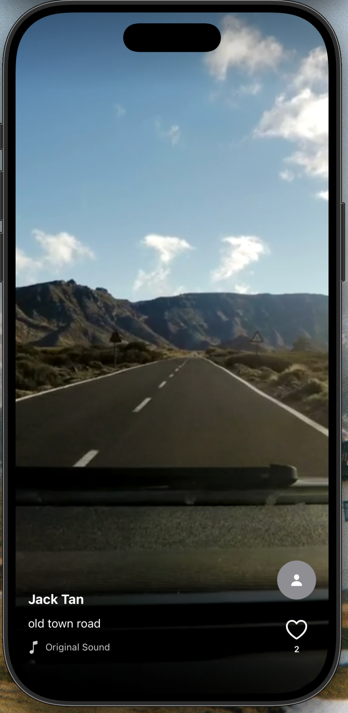

# TikTok Style Demo App

A SwiftUI-based iOS application that replicates the core video feed experience of TikTok, featuring vertical scrolling videos with smooth playback, interactive controls, and engaging animations.

## Overview

This demo app showcases a vertical video feed with full-screen videos that users can scroll through, similar to TikTok's main feed. Each video plays automatically when visible, pauses when scrolling away, and includes interactive elements like likes, double-tap animations, and tap-to-pause functionality.

## Architecture

### Core Components

#### 1. **ContentView.swift**
The main entry point of the app. Simply contains and displays the `VideoFeedView`.

#### 2. **VideoFeedView.swift**
The primary feed container that manages the scrollable video experience.

**Key Features:**
- Vertical paging scroll behavior using SwiftUI's `scrollTargetBehavior(.paging)`
- Lazy loading of video cells with `LazyVStack`
- Loading state management
- Track current video index with `scrollPosition`
- Full-screen video display using `containerRelativeFrame`

**Responsibilities:**
- Initialize and manage the `VideoPlayerManager`
- Load video data (currently using mock data)
- Track which video is currently visible
- Handle cleanup on view disappearance

#### 3. **VideoCellView.swift**
Individual video cell component that represents a single video in the feed.

**Key Features:**
- Full-screen video player
- Interactive UI overlay with gradients
- Author information and description
- Action buttons (like, profile)
- Double-tap to like with heart animation
- Single-tap to pause/resume
- Pause indicator

**Interaction Handling:**
- `handleSingleTap()`: Toggles play/pause state
- `handleDoubleTap()`: Triggers like action and shows heart animation
- `handleVisibilityChange()`: Manages playback based on visibility

#### 4. **VideoPlayerManager.swift**
Observable class that manages video playback and player lifecycle.

**Key Features:**
- Player caching for smooth scrolling
- Automatic playback management
- Video preloading support (configurable, currently set to 2 videos ahead/behind)
- Looping support for videos
- Memory management with cleanup of distant players

**Core Functions:**
- `player(for:)`: Returns or creates cached AVPlayer for a video
- `playCurrentVideo()`: Starts playback of the current video
- `pauseCurrentVideo()`: Pauses the current video
- `togglePlayPause()`: Toggles playback state
- `onIndexChanged()`: Handles video transitions when scrolling
- `cleanup()`: Removes all players and observers

#### 5. **VideoPlayerView.swift**
UIKit wrapper for `AVPlayerViewController` in SwiftUI using `UIViewControllerRepresentable`.

**Configuration:**
- Hides playback controls
- Uses `resizeAspectFill` for full-screen coverage
- Black background

#### 6. **Video.swift**
Data model representing a single video.

**Properties:**
- `id`: Unique identifier
- `videoUrl`: Remote video URL
- `author`: Creator name
- `description`: Video caption
- `likes`: Like count

**Mock Data:**
Contains 12 sample videos from Mixkit (free video library) for demonstration purposes.

## Technologies Used

- **SwiftUI**: Modern declarative UI framework
- **AVFoundation**: Video playback with AVPlayer
- **AVKit**: AVPlayerViewController for video rendering
- **Swift Concurrency**: Async/await for data loading
- **Observation Framework**: `@Observable` macro for state management

## Key Features

### Video Playback
- Automatic playback when video becomes visible
- Smooth transitions between videos
- Looping support
- Player caching for performance

### User Interactions
- ✅ Vertical scrolling with page snapping
- ✅ Tap to pause/resume
- ✅ Double-tap to like with animation
- ✅ Like button with counter
- ✅ Visual feedback (pause indicator, heart animation)

### UI/UX
- Full-screen immersive experience
- Gradient overlays for readability
- Hidden status bar
- Smooth animations
- Shadow effects on text and icons

### Performance Optimizations
- Lazy loading with `LazyVStack`
- Player caching system
- Preloading nearby videos (configurable)
- Cleanup of distant players to manage memory

## Future Enhancements

Potential improvements for this demo:
- [ ] Comments section
- [ ] Share functionality
- [ ] Follow/unfollow users
- [ ] Sound toggle button
- [ ] Video progress indicator
- [ ] Swipe gestures for additional actions
- [ ] Profile pages
- [ ] Video upload functionality
- [ ] Network data fetching (currently uses mock data)
- [ ] Improved memory management for longer feeds
- [ ] Accessibility support

## Requirements

- iOS 17.0+
- Xcode 15.0+
- Swift 5.9+

## Usage

1. Launch the app
2. Scroll vertically to browse videos
3. Tap once to pause/resume
4. Double-tap to like (shows heart animation)
5. Videos automatically play when visible and pause when scrolled away

## Code Style

This project follows modern Swift conventions:
- Swift Concurrency (async/await)
- Observation framework (`@Observable`)
- SwiftUI declarative syntax
- Composition over inheritance
- Clear separation of concerns

---

**Created by Niaaz on February 13, 2026**
